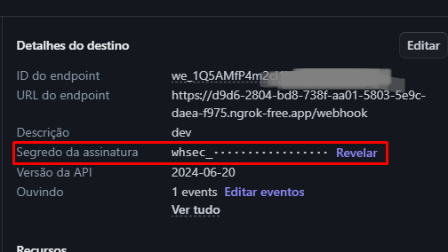
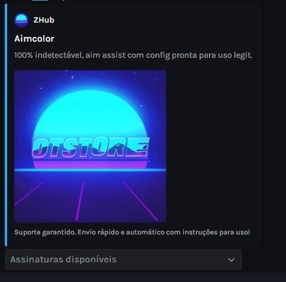
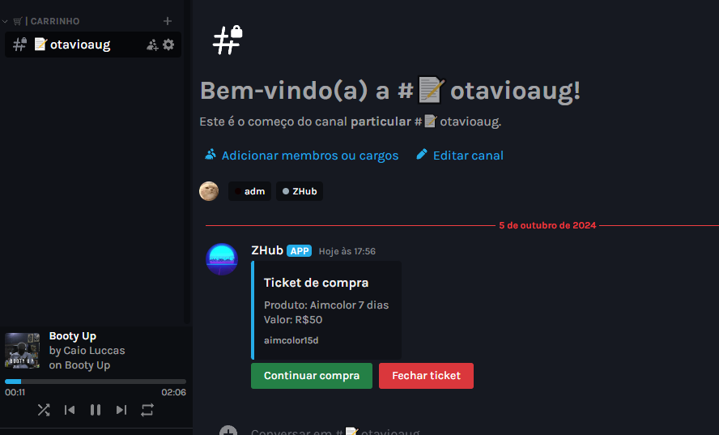

# Discord store bot

Uma aplicação que age como uma loja virtual com poucos produtos no aplicativo Discord, contando com criação de canais de tickets, integração de pagamento automático, escolha de produtos através de uma lista em formato de menu dropdown, além de um servidor Flask para que seja possível definir um webhook que será acionado pela plataforma [Stripe](https://stripe.com/br) para checar a situação da transação.

## Índice

- [Tecnologias](#tecnologias)
- [Stripe](#stripe)
- [Instalação](#instalação)
- [Utilização](#utilização)
- [Considerações Finais](#consideraçõesfinais)

## Tecnologias

- Python 3.x
- Flask
- Discord.py
- SQLite
- Stripe API

## Stripe

Para que a aplicação seja funcional, uma API Key provida pela plataforma [Stripe](https://stripe.com/br) será necessária. Essa plataforma cuidará do checkout dos produtos da nossa loja. Após a criação de conta, acesse a [dashboard](https://dashboard.stripe.com) da plataforma e crie um novo [WebHook](https://dashboard.stripe.com/test/workbench/webhooks). Nesse WebHook, selecione seu domínio com a rota "/webhook", exemplo:

```
https://d9d6-2804-bd8-738f-aa01-5803-5e9c-daea-f975.ngrok-free.app/webhook
```

Certifique-se de marcar o evento ```checkout.session.completed```. Ao mesmo tempo, verifique a chave de segurança do webhook, também fornecido pela plataforma, você pode encontrar algo como "Segredo da assinatura" na dashboard, nas informações do seu webhook, adicione-o ao arquivo .env da nossa aplicação.

A Stripe necessita ter acesso a este endereço para que ela envie uma requisição POST com os dados do checkout após o usuário efetuar o pagamento, então, este endereço não pode ser local, deve obrigatóriamente estar exposto para a internet. Caso queira testar em ambiente de desenvolvimento, recomendo utilizar o Ngrok para expor seu endereço na internet (por padrão, a porta aberta é 4242, então, localhost:4242).



## Instalação

Instale o Python em sua versão mais recente, certifique-se de marcar as opções que o façam ser adicionados ao PATH e que o "pip" seja instalado.
1. Clone o repositório:

    ```bash
    git clone https://github.com/httpsotavio/discordStoreBot.git
    ```

2. Instale as dependências necessárias

    ```python
    pip -r requirements.txt
    ```

3. Abra o arquivo .env e preencha com suas chaves de API, obtidas através da plataforma Stripe e Discord Developer Portal.

4. Em um terminal, navegue até a pasta server, e execute o seguinte comando

    ```python
    py stripePayment.py
    ```

5. Em um novo terminal, na pasta raiz do projeto, execute o seguinte comando para subir o bot ao ar

    ```python
    py bot.py
    ```

Se tudo ocorrer bem, já é pra você ter um bot funcional no ar!

## Utilização

Você deverá definir uma categoria no arquivo `donateViews.py`, no diretório `utils/views`, na linha 84, por padrão, a categoria é `"🛒| Carrinho"`, esta categoria precisa existir no seu servidor do Discord para que os canais de tickets sejam criados dentro dela.


Em um canal avulso, execute o comando `/aimcolor`, sua mensagem será deletada e o bot enviará uma mensagem com um menu dropdown, onde tudo deverá correr em um fluxo a partir dai.



Logo após, o canal de ticket poderá ser acessado pelo usuário que o solicitou, aparentando da seguinte forma:



Após isso, tudo seguirá um fluxo padrão, como você pode ver no vídeo abaixo.


## Considerações finais

O servidor em Flask puramente não é recomendado para ser usado em produção, recomendo o uso de gunicorn, para que algo robusto seja criado.